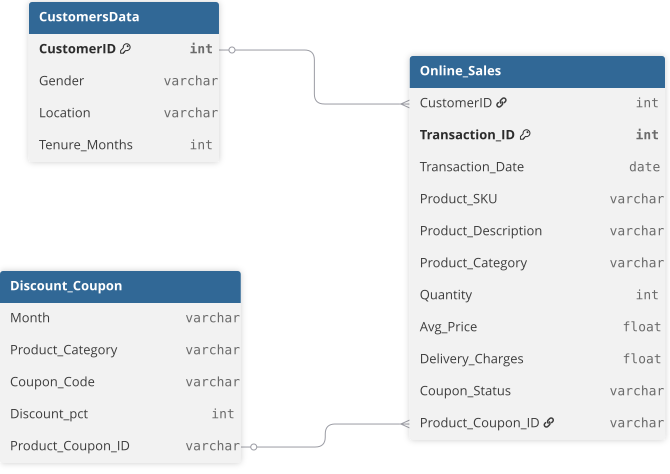
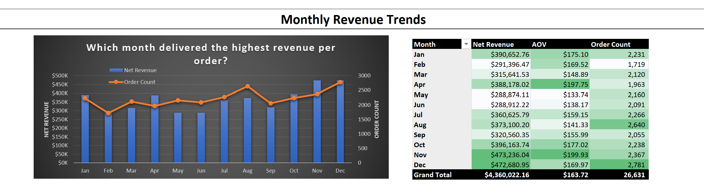
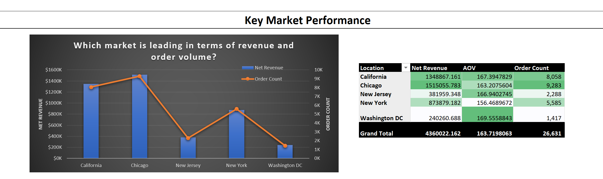
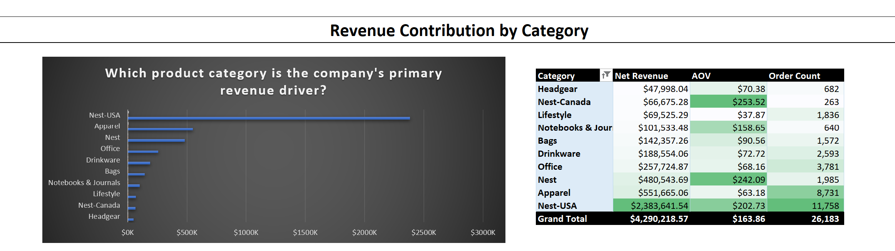
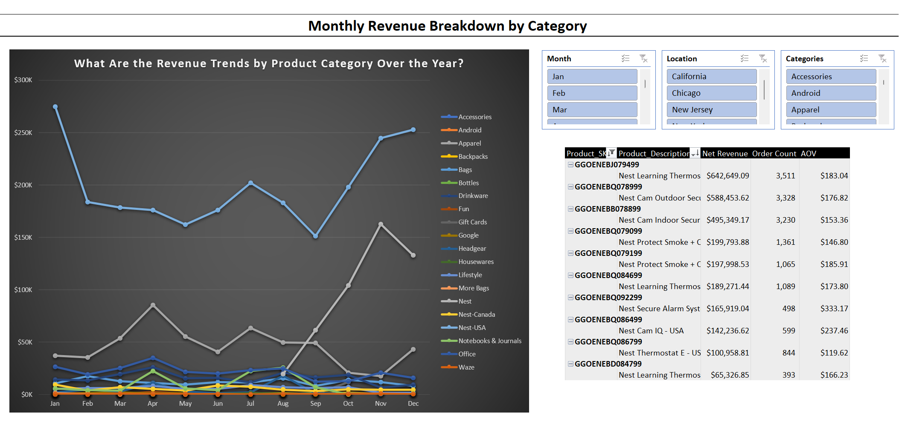
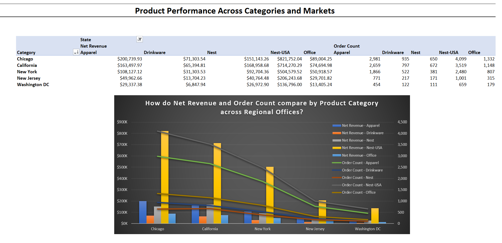
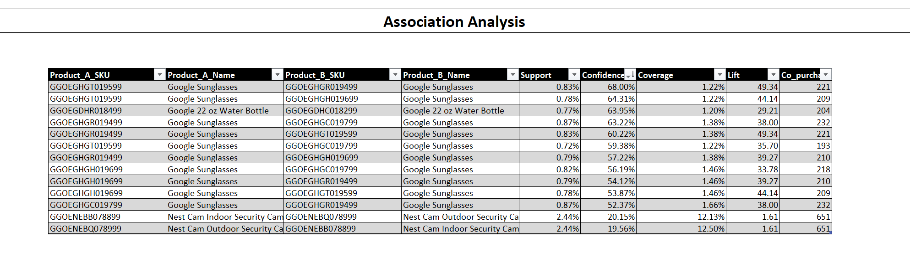

# Google Merchandise Store Sales Customer Analytics

## Project Background

This project analyzes transactional data from an e-commerce company to evaluate sales performance, product contribution, market performance, and customer behavior. The dataset contains historical transaction records covering product categories, product-level sales, customer purchases, geographic markets, order activity, and promotional information.

The analysis aims to understand the key factors influencing revenue performance and customer value, while identifying opportunities to improve sales, increase basket value, and strengthen customer retention.

The project focuses on three key areas:

- **Business Performance**: Analyze revenue trends, order volume, AOV, seasonality, and performance across key markets to identify major drivers and periods of growth or decline.

- **Product Performance**: Evaluate revenue contribution across product categories and individual products, identify high-value and high-volume products, and uncover cross-selling opportunities through association analysis.

- **Customer Analytics**: Analyze customer lifecycle and retention patterns, apply RFM segmentation to assess customer value and health, and identify opportunities to retain high-value customers and reactivate at-risk or lost customers.

The analysis leverages **Power Query**, **PivotTables**, and **Power Pivot** in **Microsoft Excel**, alongside **RFM segmentation** and **Association Rule Mining** in **R**, to transform raw transactional data into actionable business insights and strategic recommendations.

**Data Source:** [Marketing Insights for E-Commerce Company — Kaggle](https://www.kaggle.com/datasets/rishikumarrajvansh/marketing-insights-for-e-commerce-company)

## Data Structure & Initial Checks
The dataset consists of three tables: *Online_Sales*, *CustomersData*, and *Discount_Coupon*, with the Online_Sales table containing approximately **52,924** transaction records.

Before analysis, the data structure and potential relationships between the tables were reviewed, and initial data quality checks were performed using **Power Query**. These checks covered missing values, duplicate records, inconsistent data formats, and potential data integrity issues.

A key data integration challenge was identified between the *Online_Sales* and *Discount_Coupon* tables. The two tables did not initially share a common key: *Online_Sales* did not contain a Product_Coupon_ID field, while Discount_Coupon did not have a direct identifier that could be used to establish a relationship with sales transactions. To enable the integration of relevant promotional information, a derived Product_Coupon_ID was created by concatenating Month and Product_Category in both tables.

The resulting table structure and the derived Product_Coupon_ID used for data integration are illustrated below:

  

Although this approach established a potential link between the two tables, maintaining the relationship through a formal relational model required additional transformations and introduced unnecessary complexity. Therefore, relevant fields from the supporting tables were instead integrated into the main *Online_Sales* dataset using **VLOOKUP** and **XLOOKUP** in **Microsoft Excel**. This resulted in a consolidated dataset containing the sales, customer, and promotional information required for subsequent analysis.

## Business Performance Overview

The analysis begins by assessing overall business performance across time, markets, and product categories to identify the primary drivers of revenue and areas requiring further investigation.

### Monthly Revenue Trends

  

- **Monthly revenue fluctuated between approximately $250K and $500K** throughout 2019, with a clear increase during the year-end holiday season. November and December recorded the highest revenue, indicating strong seasonal demand toward the end of the year.

- In contrast, **order volume remained relatively stable throughout the year**. The revenue slowdown in May and June was therefore driven primarily by a significant decline in AOV, rather than a substantial drop in order volume. This suggests that the main opportunity during weaker periods is to increase spend per order rather than simply generate more transactions.

### Key Market Performance

  

- **Chicago is the strongest-performing market**, generating higher revenue and order volume than both California and New York. While California and New York have larger market potential, their lower performance suggests opportunities to improve customer conversion, product penetration, and spend per order.

- In contrast, **New Jersey and Washington DC generate lower revenue in line with their smaller market scale**, suggesting that their performance should be evaluated in the context of market size rather than directly compared with larger markets.

### Revenue Contribution by Category

  

- **Revenue and order volume are heavily concentrated in Nest-USA and Apparel, but the two categories play distinct roles**. Nest-USA is the primary revenue driver, combining high order volume with a strong AOV, while Apparel generates substantial order volume but at a considerably lower AOV.

- Meanwhile, **Nest and Nest-Canada demonstrate strong customer spending potential**, achieving the highest AOVs despite lower order volumes. This suggests that the broader Nest portfolio may provide opportunities to increase basket value and customer spending beyond the core Nest-USA category.

#### Section Takeaways:

Overall, **business performance is driven by a combination of seasonal demand, market-level differences, and a concentrated product portfolio**. The analysis highlights **three key areas for deeper investigation**: **which products drive seasonal revenue fluctuations, why Chicago outperforms other major markets, and how high-volume purchases can be converted into higher customer value**. This leads to the next section, Product Insights, which examines product-level performance, market-specific product contributions, and cross-selling opportunities to understand how revenue can be further optimized.

## Product Insights

While the Business Performance Overview identified the key revenue patterns across time, markets, and categories, the next step is to examine which products drive these patterns, how product performance varies across markets, and where opportunities exist to increase customer spending through complementary purchases.

### Monthly Revenue Breakdown by Category and Product

  

**By Category**

- **The May–June revenue slowdown was driven by simultaneous declines in Nest-USA and Apparel**, indicating that the business was particularly vulnerable when its two largest categories weakened at the same time.

- **The year-end revenue surge was driven primarily by strong growth in Nest-USA, while Nest emerged as an additional contributor and offset the slight decline in Apparel**. This suggests a shift in the product mix toward Nest-related products during the peak season.

- **The seasonal contribution of major categories differs throughout the year**, suggesting that product-specific performance plays an important role in overall revenue fluctuations rather than revenue changes being driven solely by order volume.

- **Revenue is highly concentrated among a small group of Nest products**, with the Nest Learning Thermostat 3rd Gen – Stainless Steel generating the highest revenue at approximately $643K, followed by Nest Cam Outdoor at $588K and Nest Cam Indoor at $495K.

**By Product**

- **Revenue is highly concentrated among a small group of Nest products**, with the Nest Learning Thermostat 3rd Gen – Stainless Steel generating the highest revenue at approximately $643K, followed by Nest Cam Outdoor at $588K and Nest Cam Indoor at $495K.

- **The strongest products combine both high revenue contribution and substantial order volume**, indicating that they are not only high-value products but also have broad customer demand. At the same time, products such as the Nest Secure Alarm System Starter Pack and Nest Cam IQ achieve relatively high AOVs despite lower order volumes, suggesting potential for targeted promotion as higher-value products within the Nest portfolio.

- Overall, **the product portfolio shows a strong concentration around smart home and security products**, with Thermostats, Cameras, and Home Security devices accounting for the majority of top-performing products.

### Product Performance Across Categories and Markets

  

- **Differences in market performance are closely linked to the performance of core product categories**. Chicago's stronger revenue and order volume are supported by stronger performance across key categories, particularly Nest-USA and Apparel, suggesting that its market advantage is influenced not only by market size but also by product demand and purchasing behavior. Meanwhile, **California and New York** represent opportunities to improve product penetration and customer spending. Their **strong market potential, combined with lower performance than Chicago, suggests that successful product and selling strategies observed in Chicago may be transferable to these larger markets**.

- For **New Jersey and Washington DC, lower revenue is more consistent with their smaller market scale**. Product strategies in these markets should therefore focus on categories with demonstrated demand rather than broad expansion across the entire product portfolio.

### Association Analysis

  

- **Association analysis identifies opportunities to increase basket value through complementary product purchases**. Nest Cam Indoor and Nest Cam Outdoor show a meaningful purchasing relationship, with 651 co-purchases and a Lift of 1.61, indicating that customers who purchase one product are more likely than average to purchase the other. **The analysis also identifies associations among Google Sunglasses SKUs**, suggesting that customers may be receptive to purchasing multiple products within the same product family.

- **These patterns indicate that cross-selling opportunities exist both across complementary products and within related product families**, providing a way to increase basket value without relying solely on acquiring additional customers.

#### Section Takeaways

- Overall, **product performance is driven by a concentrated portfolio of high-performing Nest products**, while the relative contribution of major categories changes across the year. The analysis also shows that **market performance is partly associated with differences in product demand and category performance**, with Chicago providing a useful benchmark for larger markets such as California and New York.

- **Beyond individual product performance, purchasing associations reveal opportunities to increase basket value through complementary products and product-family recommendations**. These findings provide a foundation for the strategic actions presented at the end of the analysis, particularly around seasonal product planning, market expansion, and cross-selling.

## Customer Insights

While product analysis explains what drives revenue and where additional sales opportunities exist, customer analysis examines who generates this value, how customer behavior evolves over time, and whether the current revenue base can be sustained.

### Customer Lifecycle Performance Analysis

  

